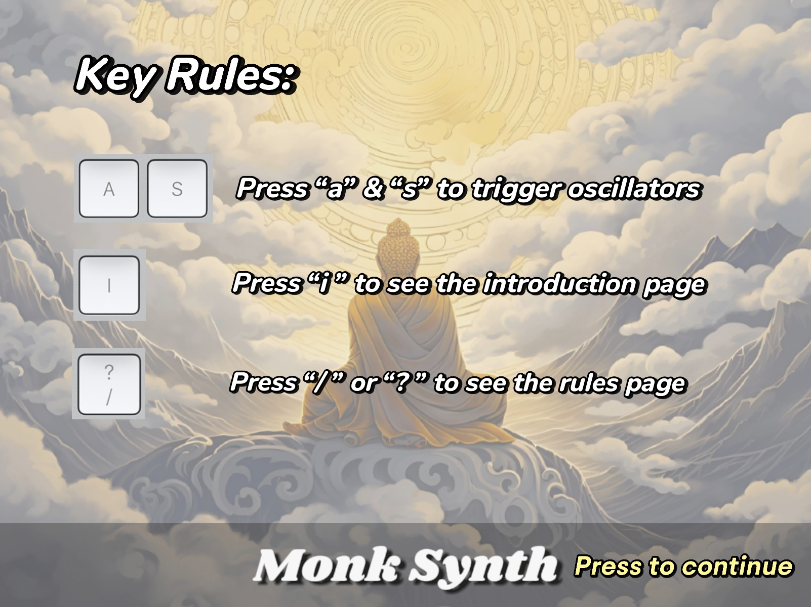
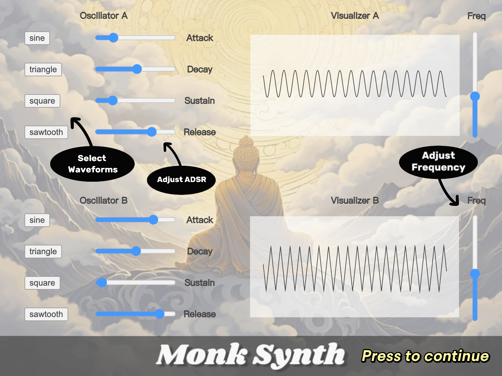

<h1 align="center">Monk Synth<br>
  <a href="README.md"></a><strong style="font-size: 24px; line-height: 20px; margin: 0 50px;"> </strong><a href="README.zh.md"></a>
</h1>


<!-- -->
<!-- -->
<!-- -->


<!--[](README.md)-->
<!--[](README.zh.md)-->


## Project Overview

Monk Synth is a web-based audio synthesizer built with p5.js, inspired by an interest in Buddhism and the exploration of sound synthesis. This project aims to provide an interactive audio synthesis environment where users can control sound waveforms and pitch through various inputs.

## Features

- **Dual Oscillators**: Each oscillator can select different waveforms and adjust ADSR (Attack, Decay, Sustain, Release) parameters.
- **Audio Visualization**: Visual representation of audio waveforms in real-time, allowing users to see the sound changes visually.
- **Interactive Controls**: Users can adjust audio parameters using sliders and buttons to create diverse sound effects.


## Live Demo

We currently only support it on computers, and we will add support for mobile devices in the future.

Experience Monk Synth live through this link: **[Monk Synth Live](https://editor.p5js.org/1805318611/full/ivbzDqVz1)**

For the Best Experience, We Recommend Using [Chrome](https://www.google.com/chrome/).

## Local Installation

To run Monk Synth locally, you need to clone the repository first:

```bash
git clone https://github.com/YPO123/Monk_Synth.git
```

Then, you can serve the project using any static server. For instance, if you have Node.js installed, you can use http-server:

```bash
  npm install -g http-server
  cd Monk_Synth
  http-server
```

Access http://localhost:8080 to start the synthesizer.

## Usage

Once the project is up and running, the interface will provide several control options:

### Keyboard Controls

- **`A` Key**: Starts and stops __Oscillator A__. When pressed, the oscillator will start playing, and when released, it will stop.
- **`S` Key**: Controls __Oscillator B__ in the same manner as the `A` key.
- **`I` Key**: Pressing `I` will display the __software introduction__, providing the overview page.
- **`?` or `/` Key**: Displays __help__ or additional information about how to use the synthesizer. 

### Interactive Controls

- **Waveform Selection**: Click on the waveform buttons to choose the desired oscillator __waveform__.
- **ADSR Control**: Use the __ADSR__ sliders to adjust the dynamics of the sound.
- **Frequency Adjustment**: Drag the frequency sliders to change the __base frequency__ of the oscillator.




## How to Contribute

Contributions are welcome in any form, be it new features, bug fixes, or documentation updates. Please fork this repository and submit your pull requests.

## Acknowledgments

Thanks to all the developers and designers who participated in and supported the development of Monk Synth.

### Notes:

- Ensure that all links and commands are updated to match those of your actual project.
- If there is a live demo, remember to update the link in the "Live Demo" section.
- Tailor the installation instructions and dependencies to your project’s actual requirements.
