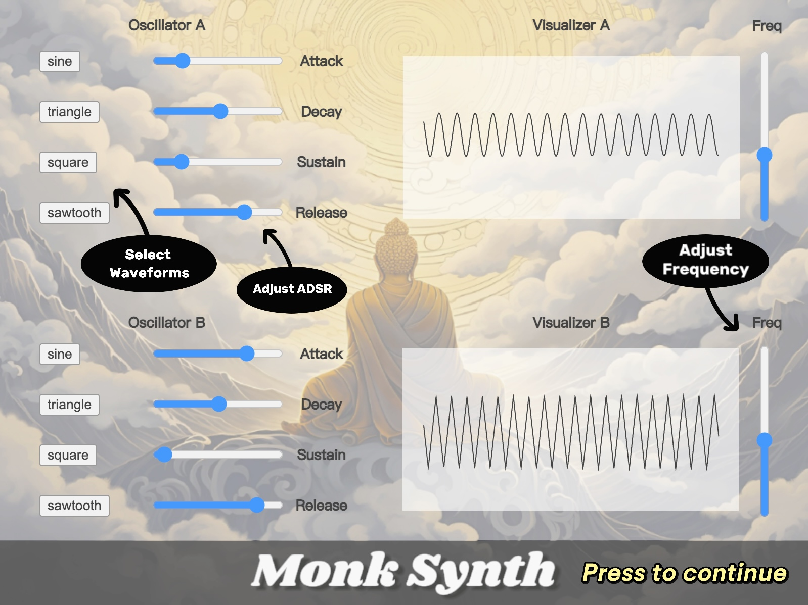

# 圣僧合成器


## 项目概述

Monk Synth是一个基于web的音频合成器，使用p5.js构建，灵感来自对佛教的兴趣和声音合成的探索。该项目旨在提供一个交互式音频合成环境，用户可以通过各种输入控制声音波形和音高。

## 特性

- **双振荡器**: 每个振荡器可以选择不同的波形和调整ADSR(攻击，衰减，维持，释放)参数。
- **示波器**: 实时音频波形的可视化表示，使用户可以直观地看到声音变化。
- **交互控制**: 用户可以使用滑块和按钮来调整音频参数，以创造不同的声音效果。

## 演示网页

我们现在仅支持在电脑上运行，后续我们会增加对移动设备的支持。

通过这个链接体验Monk Synth: **[Monk Synth Live](https://editor.p5js.org/1805318611/full/ivbzDqVz1)**

为了获得最佳体验，我们建议使用 [Chrome](https://www.google.com/chrome/).

## 本地安装

要在本地运行Monk Synth，首先需要克隆存储库:

```bash
git clone https://github.com/YPO123/Monk_Synth.git
```

然后，您可以使用任何静态服务器为项目提供服务。例如，如果你安装了Node.js，你可以使用http-server:

```bash
  npm install -g http-server
  cd Monk_Synth
  http-server
```

访问 http://localhost:8080 启动合成器。

## 使用说明

一旦项目启动并运行，界面将提供几个控制选项:

### 按键控制

- **`A` 键**: 启动和停止**振荡器A**。当按下时，振荡器将开始播放，当释放时，它将停止。
- **`S` 键**: 以与'A'键相同的方式控制**振荡器B**。
- **`I` 键**: 按下'I'将显示**软件介绍**。
- **`?` 或 `/` 键**: 显示有关如何使用合成器的帮助或其他信息。这可以是一个弹出窗口，也可以是一个解释不同控件和特性的页面。

### 交互控制

- **波形选择**: 点击波形按钮选择想要的振荡器波形。
- **ADSR控制**: 使用ADSR滑块来调整声音的动态。
- **频率调整**: 拖动频率滑块以改变振荡器的基频。




## 如何共创

欢迎任何形式的共创，无论是新特性、错误修复还是文档更新。请fork这个仓库并提交您的pull请求。

## 致谢

感谢所有参与和支持Monk Synth开发的开发人员和设计师。

### 注意:

- 确保所有链接和命令都更新为与实际项目的链接和命令相匹配。
- 如果有现场演示，记得更新“现场演示”部分的链接。
- 根据项目的实际需求定制安装说明和依赖项。
